<p align="center">
  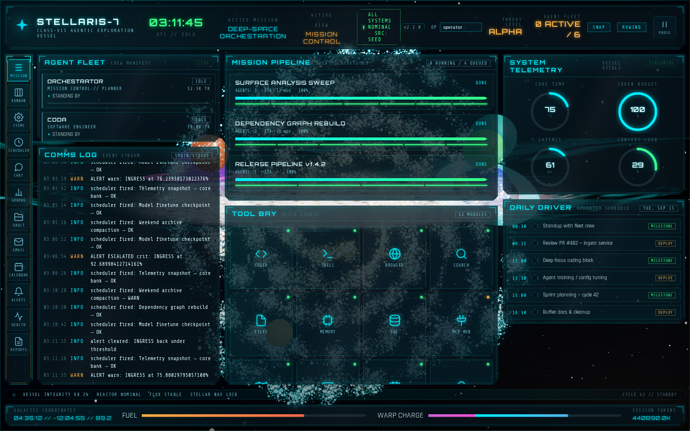
</p>

<h1 align="center">STELLARIS-7 · Starship HUD Mission Control</h1>

<p align="center">
  A realtime <strong>starship HUD</strong> for orchestrating <strong>multi-agent agentic workflows</strong> — six crew agents, superstep DAG scheduling, checkpoints, interrupts, span-level traces, and a live 3D procedural galaxy, all driven by a single Node orbit server over WebSocket.
</p>

<p align="center">
  <a href="https://github.com/genpozi/starship-hud/actions/workflows/ci.yml"></a>
  
  
  
  
  
  
</p>

<p align="center">
  <a href="#features">Features</a> · <a href="#screenshots">Screenshots</a> · <a href="#getting-started">Getting Started</a> · <a href="#architecture">Architecture</a> · <a href="#documentation">Docs</a> · <a href="#testing">Testing</a> · <a href="#customization">Customization</a>
</p>

---

## Why STELLARIS-7?

A mission-control console is the oldest interface metaphor for observability — and it is still the best one for watching autonomous agents work. STELLARIS-7 is a **working agent orchestrator wrapped in a starship HUD**: a Node/Express + WebSocket orbit server is the single source of truth for fleet state, the browser mirrors it in real time, and a live Three.js galaxy (spiral arms, nebula, ringed planets, bloom) renders behind every view.

It runs **fully offline** out of the box (deterministic heuristic planner), and optionally upgrades to a real LLM planner, real GitHub issue/PR sync, Gmail/Graph/ICS comms, and a real Hermes WebUI agent bridge via operator-supplied credentials.

---

## Features

### Realtime agent orchestration

- **Six crew agents** (`ORCHESTRATOR`, `CODA`, `PILOT`, `SAGE`, `LINK`, `NUDGE`) with state machines, typed tool schemas, retry policies, and error states — no spinning forever.
- **Superstep DAG scheduling (P8)** — operator goals are planned into steps with `dependsOn` chains; a step only starts once every dependency has completed. No more all-in-parallel chaos.
- **Operator chat console** — `@AGENT` mentions pin the plan and reply to a specific agent; replies are synthesized in-character and grounded in the fleet's own knowledge vault.
- **Approval bridge** — tools that need a human in the loop surface an approval card in the HUD (`approve` / `deny` / timeout). Routed to the run owner (P13).
- **Operator packaging (P12)** — `stellaris-hud serve` / `demo` / `probe`. `.stellaris.json` mirrors `.env.example`; env still wins.

### Mission-control reliability

- **Checkpoints + rollback (P10)** — a boot-guard snapshot plus on-demand full-state snapshots (capped ledger of 8); SNAP / REWIND on the topbar (or REST) restores the previous state and reports exactly which slices were reverted.
- **Single-holder interrupt (P11/P13)** — pause/resume via the topbar button or API. In-flight steps finish, dispatch pickup halts. A second operator gets `409` until the holder resumes.
- **Trace / span telemetry (P12)** — every run/tool call records a span with `ms` + token accounting; Health TRACE strip + reader.
- **Command palette** — `Ctrl/Cmd+K` jumps views, pause, snap, rewind, ACK ALL, TODAY, compose. `1`–`0` / `[` `]` cycle the rail.
- **Knowledge filters** — Vault/Reports title+tag typeahead; compose file chips with a WARN when an attachment exceeds the 200KB cap.
- **Filesystem vault (P14)** — `data/vault/*.md` + front matter; skills write the file first, then state.

### Realtime data plane

- **Snapshot/delta WebSocket protocol** — full state on connect, then diffed deltas (~1.5 s) with monotonic `seq`, gap detection, resync, and exponential-backoff reconnect.
- **Typed event channels (P9)** — non-state frames (`events`, `approval`, `chat`) fold through client-side reducers; unknown frame types are ignored so a newer server never breaks an older client.
- **Offline fallback** — if the server is unreachable the HUD switches to a self-contained simulation, so the console never goes dark.

### Views

12 focused screens — **Mission Control** (rollup), **Kanban**, **Open Items**, **Scheduler**, **Chat**, **Graphs**, **Vault**, **Email** (folders, reply, compose attach), **Calendar** (week PREV/NEXT/TODAY), **Alerts**, **System Health** (TRACE), **Research Reports** (readers + status cycle).

### Optional live integrations

| Source | What it syncs | Env vars |
| --- | --- | --- |
| **GitHub** | Issues + PRs → kanban board (ETag incremental, rate-limit guarded) | `GITHUB_TOKEN`, `GITHUB_OWNER`, `GITHUB_REPO` |
| **Hermes WebUI** | Real agent delegation + approval bridge + reverse-ingest of sessions/crons | `USER_HERMES_URL`, `USER_HERMES_PASSWORD`, `USER_HERMES_INGEST_MS`, `USER_HERMES_APPROVAL` |
| **LLM planner** | LLM goal decomposition (heuristic offline fallback) | `USER_LLM_API_KEY`, `USER_LLM_BASE_URL`, `USER_LLM_MODEL` |
| **Email / calendar** | Inbox + 7-day calendar via Gmail, Microsoft Graph, ICS, CalDAV, or inbound webhook | `USER_COMMS_*`, `USER_GOOGLE_*`, `USER_MS_*`, `USER_ICS_*`, `USER_CALDAV_*` |

---

## Screenshots

All **12 views**, captured live against the running orbit server (1440×900).

| Mission Control (rollup) | Kanban | Open Items |
|:---:|:---:|:---:|
|  | 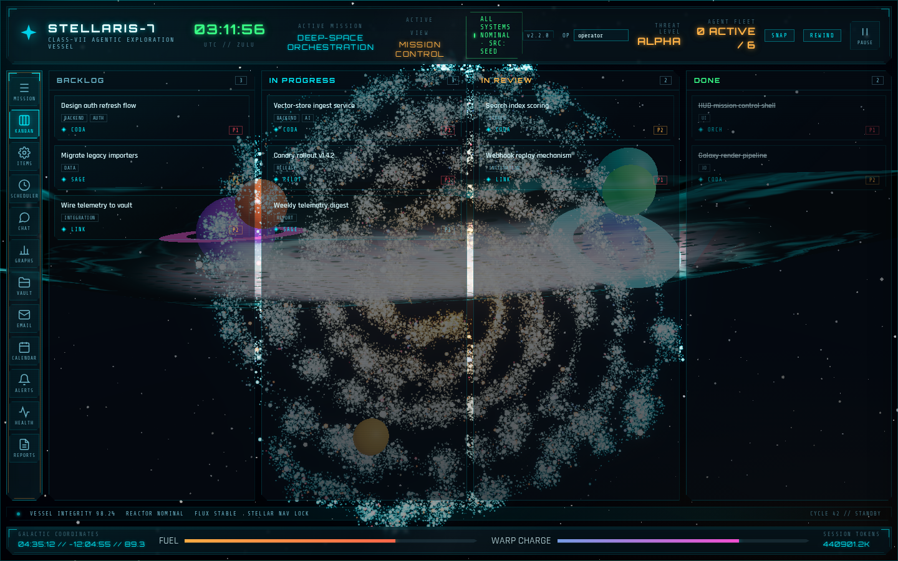 | 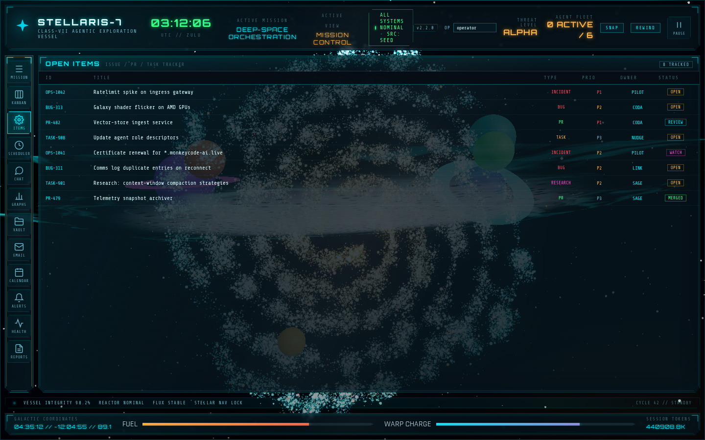 |
| **Scheduler** | **Agent Chat** | **Graphs & Analytics** |
| 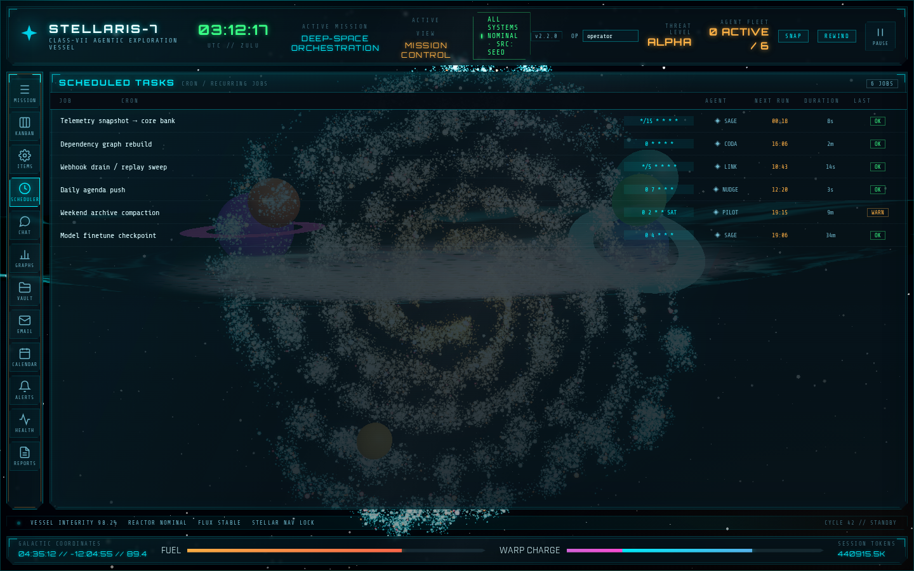 | 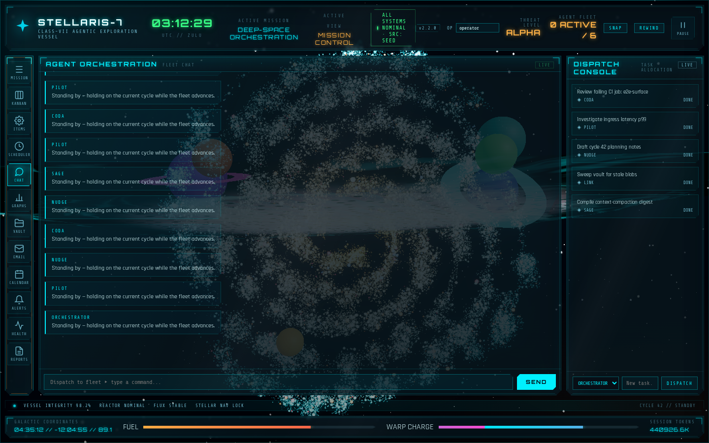 | 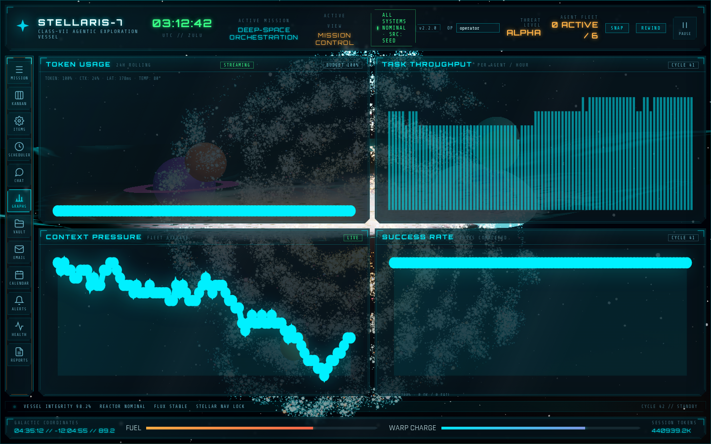 |
| **Vault & Knowledge** | **Email** | **Calendar** |
| 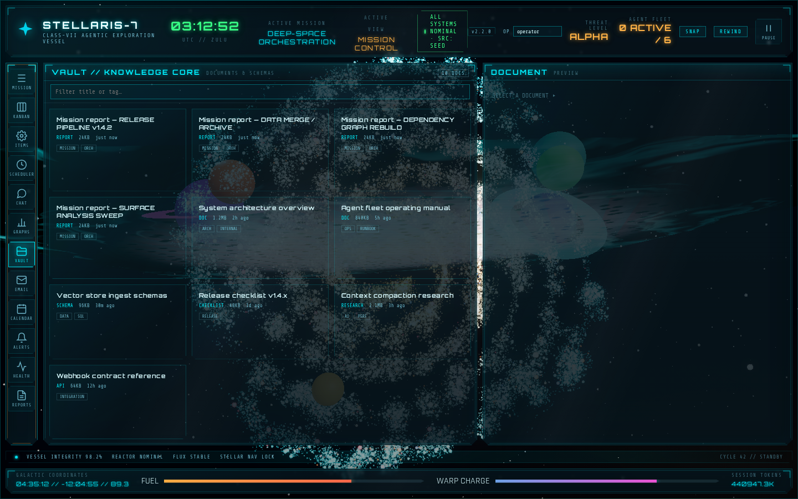 | 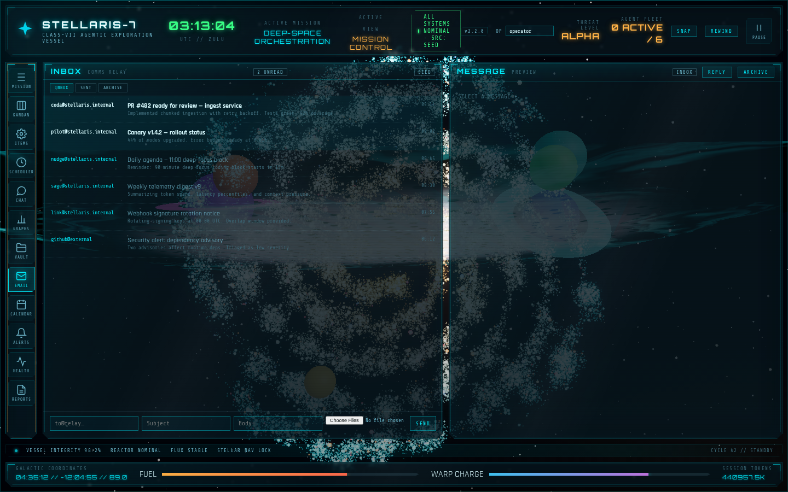 | 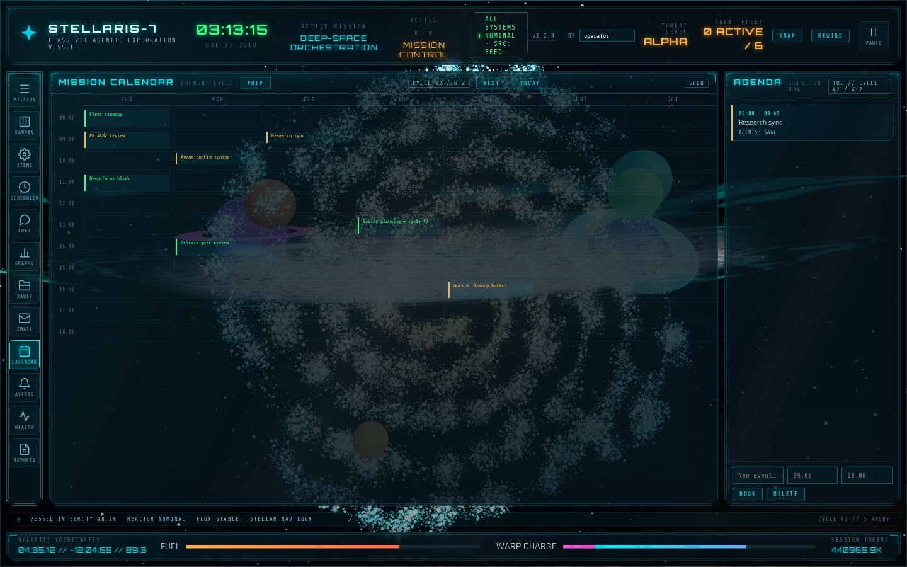 |
| **Alerts** | **System Health** | **Research Reports** |
| 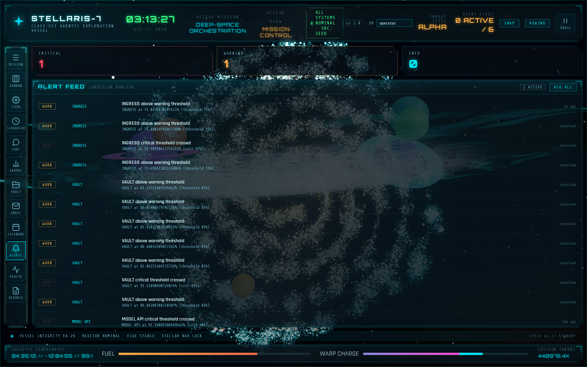 | 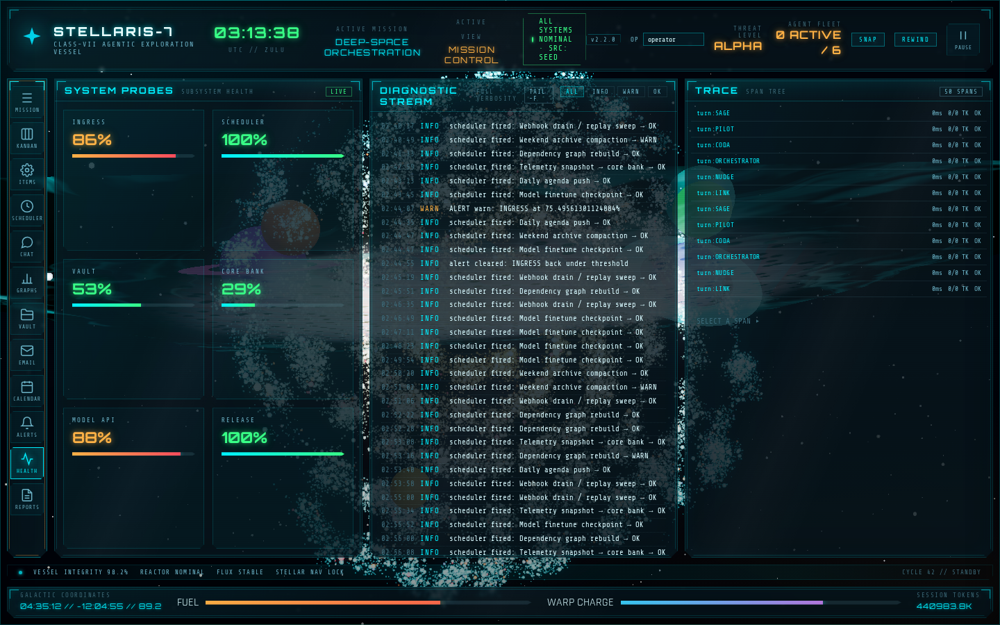 | 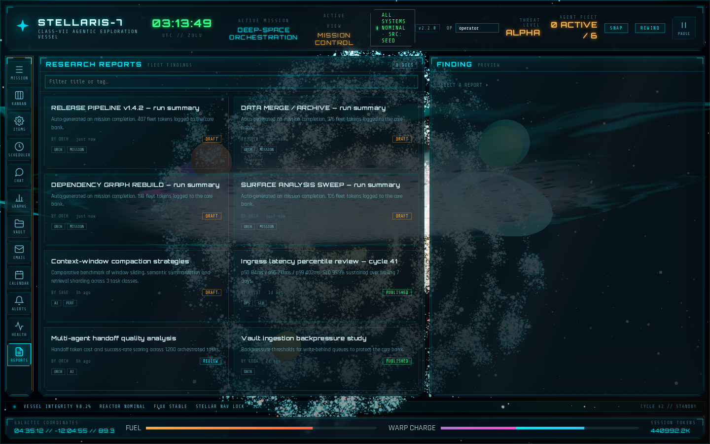 |

> Captured with the default seed data (`SRC: SEED`). Live providers change the
> row contents, not the shapes. Further evolution: `docs/EVOLUTION.md`.
> Working context: `docs/CONTEXT.md`.

### Walkthrough video

Live capture of the running HUD — auto-clicks through the main left-nav workspaces
(Mission Control → Kanban → Agent Chat → Graphs → System Health → Alerts → Vault),
with the realtime panels animating under each view.

<video src="assets/video/walkthrough.webm" width="880" controls preload="metadata" loop>
  <a href="assets/video/walkthrough.webm">Download the walkthrough (webm)</a>
</video>

---

## Getting started

Requires **Node.js 20+**. Zero external services needed for the default experience.

```bash
# 1. Install dependencies
npm install

# 2. Orbit server — REST + WebSocket on :3001 (owns fleet state)
npm run dev:server

# 3. In a second terminal — Vite dev server on :5173
#    (proxies /api and /ws to the orbit server)
npm run dev
```

Open the URL Vite prints (default `http://localhost:5173`) and use the left nav rail to switch views. Day-to-day operator guide: `docs/MANUAL.md`.

**One-command demo** (mock Hermes WebUI :8787 + orbit :3001 + Vite :5173):

```bash
./scripts/demo.sh
```

**Production** — build, then serve everything from the Express server on :3001:

```bash
npm run build
npm start
```

Or the packaged CLI (`serve` = orbit + `dist`; `demo` = mock + orbit; `probe` =
Hermes contract). Copy `.stellaris.json.example` to `.stellaris.json` (env still
wins):

```bash
npx stellaris-hud serve
```

### Optional LLM planning

Copy `.env.example` to `.env` and set `USER_LLM_API_KEY`, `USER_LLM_BASE_URL`, `USER_LLM_MODEL`. The chat planner will then ask the model to decompose operator goals into orchestrated steps. Without a key it uses the deterministic heuristic planner — fully offline.

Validate a live Hermes WebUI against the bridge contract before enabling it:

```bash
./scripts/probe.sh --url http://127.0.0.1:8787
```

See `docs/MANUAL.md` for the operator use manual, `docs/DEPLOYMENT.md` for Docker/probe, and `docs/HERMES-INTEGRATION.md` for the Hermes bridge.

---

## Architecture

```
Browser (Vite SPA)                Orbit server (Node, port 3001)
┌──────────────────────┐   WS    ┌────────────────────────────────┐
│ src/main.js   boot   │◄───────►│ server/index.js    express + ws │
│ src/store.js  state  │  /ws    │ server/orchestrator.js  engine │
│ src/views.js  views  │  REST   │ server/planner.js   LLM/heuris.│
│ src/api.js    bridge │ /api/*  │ server/skills.js    tool reg.  │
│ src/channels.js typed│         │ server/trace.js     span tree  │
│ src/galaxy.js 3D bg  │         │ server/checkpoints.js snapshots│
│ src/config.js seed   │         │ server/store.js     persistence│
│                      │         │ server/vault.js     md files   │
└──────────────────────┘         │ data/state.json + vault/*.md   │
                                 └────────────────────────────────┘
```

- **Single source of truth** — the orbit server owns canonical state; the browser mirrors it over WebSocket (snapshot → diffed deltas) and mutates it via REST.
- **Agent step machine** — dispatched jobs run through a step machine with `dependsOn` gating; in-flight steps finish during an interrupt; completed spans feed the trace slice.
- **Persistence** — `data/state.json` is debounced-flushed; `data/vault/*.md` is the knowledge core (file first, then state). Both honor `STELLARIS_DATA_DIR`. A boot checkpoint is captured every start.

See `docs/ARCHITECTURE.md` and `docs/API.md` for details.

---

## Documentation

| Doc | What it covers |
| --- | --- |
| `docs/MANUAL.md` | **operator use manual** — chrome, 12 views, keyboard, live sources, troubleshooting |
| `docs/ARCHITECTURE.md` | runtime modes, data flow, module map, WS protocol, adding integrations |
| `docs/API.md` | full REST + WebSocket reference, state shape |
| `docs/DEVELOPER.md` | developer guide — data model, skills, mutations, testing, debugging |
| `docs/HERMES-INTEGRATION.md` | Hermes bridge + GitHub reverse ingest (historical plan + current runbook) |
| `docs/COMMS-INTEGRATION.md` | Gmail / Graph / ICS / CalDAV adapters + inbound webhook |
| `docs/DEPLOYMENT.md` | Docker, compose, demo/probe, data sources |
| `docs/ORCHESTRATION-RESEARCH.md` | framework research (openai-agents, langgraph, crewAI) → adopted patterns |
| `docs/CONTEXT.md` · `docs/EVOLUTION.md` | working memory + post-2.2.0 plan/history |
| `docs/RESEARCH.md` · `docs/PLAN.md` | design history and Phases 1–10 (historical) |
| `CHANGELOG.md` | version history (Keep a Changelog) |
| `CONTRIBUTING.md` | commit style, branch/PR flow, review checklist |
| `SECURITY.md` | vulnerability reporting + operator security posture |
| `CODE_OF_CONDUCT.md` | community standards |

---

## Testing

19 headless suites, each isolated with a fresh `STELLARIS_DATA_DIR` and a fresh Hermes mock:

```bash
npm test
```

| Suite | Guards |
| --- | --- |
| `hermes` / `hermes-ingest` / `phase4` / `github` | bridge client, reverse ingest, engine, GitHub sync |
| `planner` / `skills` / `chat` | goal planning, tool registry, chat contract (`@AGENT` routing) |
| `views` | headless renders of every HUD view via a DOM shim + full slice contract |
| `superstep` / `channels` / `checkpoints` / `interrupt` / `trace` | P8 dependency barrier, P9 reducers, P10 snapshots, P11 hold/resume, P12 spans |
| `comms` | Gmail/Graph/ICS mappers, merge, inbound, rfc822 (no network) |
| `regression` | review-fix guards (escapeHtml, in-flight gating, mention detection) |
| `cli` / `operators` | P12 argv + `.stellaris.json` (env wins); P13 hello/pause-holder/approval owner |
| `vault` | P14 filesystem knowledge core (front matter, file-then-state, hydrate) |
| `integration` | boots a real orbit server — full REST + WebSocket surface |

---

## Project structure

```
.
├── index.html            # HUD shell markup + all view containers
├── package.json          # dev:server / dev / build / start / test / probe
├── vite.config.js        # dev server + /api /ws proxy + build config
├── .env.example          # operator credentials (user-supplied, never committed)
├── Dockerfile            # multi-stage, non-root, healthcheck
├── docker-compose.yml    # orbit + optional mock, orbit-data volume
├── LICENSE · CHANGELOG.md · CONTRIBUTING.md · SECURITY.md · CODE_OF_CONDUCT.md
├── .github/              # CI workflow, issue/PR templates
├── docs/                 # architecture, API, developer, deployment, research, CONTEXT, EVOLUTION
├── assets/screenshots/   # README gallery captures
├── server/               # orbit backend
│   ├── index.js          # express + ws entry point
│   ├── orchestrator.js   # heartbeat engine, step machine, all mutations
│   ├── planner.js        # LLM-backed (optional) + heuristic planning (P8 deps)
│   ├── skills.js         # sandboxed tool registry (incl. hermes/mail/calendar)
│   ├── comms.js          # Gmail / Graph / ICS / CalDAV adapters + inbound webhook
│   ├── trace.js          # P12 span tree + token accounting
│   ├── checkpoints.js    # P10 snapshot/rollback (capped ledger)
│   ├── store.js · seed.js# JSON persistence + seed from src/config.js
│   ├── github.js · hermes.js · hermes-ingest.js · hermes-contract.js
│   ├── cli-config.js · operators.js · vault.js
│   └── mock-hermes.js    # hermes-webui test double
├── bin/stellaris-hud.js  # P12 CLI: serve / demo / probe
├── test/                 # 19 suites + run-all.mjs (fresh mock per suite)
├── scripts/              # demo.sh, probe.sh
└── src/
    ├── main.js           # boot, offline sim fallback, view router
    ├── store.js · api.js # canonical STATE + WS/REST bridge
    ├── channels.js       # P9 typed event channel reducers
    ├── views.js          # renderer for every view
    ├── galaxy.js         # Three.js 3D scene (galaxy, nebula, planets, stars)
    ├── style.css         # full HUD theme + animations + per-view styles
    └── config.js         # seed data for every dashboard view
```

---

## Customization

All dashboard content lives in `src/config.js`. Edit the exports to rename the ship, swap the crew, reshape the board, or retheme the HUD (`SHIP`, `AGENTS`, `WORKFLOWS`, `TOOLS`, `AGENDA`, `KANBAN_COLUMNS`/`KANBAN_CARDS`, `OPEN_ITEMS`, `SCHEDULED_TASKS`, `CHAT_SEED`, `VAULT_DOCS`, `EMAILS`, `CALENDAR_EVENTS`, `ALERTS`, `PROBES`, `REPORTS`).

- **Agent states** — `active | busy | idle | error` (drives color + animation).
- **Workflow states** — `running | queued | done | failed`.
- **Kanban** — edit `KANBAN_COLUMNS` to rename/reorder columns; cards reference `col` by id.
- **Alerts** — `sev` is `crit | warn | info`; drives summary cards and feed styling.
- **Theme** — color and motion tokens are CSS custom properties at the top of `src/style.css` (`--line-cyan: #00e5ff`, `--line-amber: #ffb347`, `--ok: #39ff88`, `--crit: #ff4d5e`, `--scan-time: 9s`). The 3D scene parameters (arm count, particle counts, planet positions, nebula colors) are constants at the top of `src/galaxy.js`.

### Adding a new view

1. Add a `<section id="view-yourname" class="view">` in `index.html`.
2. Add a `<button class="nav-btn" data-view="yourname">` in the nav rail.
3. Write a `renderYourName()` in `src/views.js` and call it in `main.js` `boot()` + refresh loop.

---

## Design notes

- **HUD panels** — clipped angular corners (`clip-path`), corner brackets, backdrop blur over the 3D scene.
- **View router** — instant panel switching with a fade/scale transition; the 3D galaxy persists behind every view.
- **CRT layer** — scanline overlay + slow moving scan bar for the "live viewport" feel.
- **Motion** — pulsing status dots, flowing warp bar, progress fills, log line entrance, mouse-parallax camera, breathing planet glows, ambient agent chat; respects `prefers-reduced-motion`.
- **Fonts** — Orbitron (display), Rajdhani (UI), Share Tech Mono (data) via Google Fonts, with system fallbacks.

---

## Roadmap

- [x] Realtime snapshot/delta transport + offline fallback
- [x] Superstep DAG scheduling (P8) — `dependsOn` gated pickup
- [x] Typed event channels + reducers (P9)
- [x] Checkpoints + rollback (P10) with boot-guard snapshot
- [x] Single-operator interrupt / pause / resume (P11)
- [x] Trace / span telemetry streamed as typed events (P12)
- [x] GitHub + Hermes WebUI live integrations (operator-supplied creds)
- [x] Email/calendar (Gmail, Graph, ICS, CalDAV) + HUD folders/week-nav/attach
- [x] Command palette, SNAP/REWIND, TRACE HUD, TODAY
- [x] Publish a packaged CLI (`stellaris-hud serve`) with declarative config
- [x] Multi-operator sessions + per-operator approval routing
- [x] Filesystem vault (`data/vault/*.md` + front matter)
- [x] All 12-view screenshots + `assets/video/walkthrough.webm` recaptured

---

## License

[MIT](LICENSE)

<p align="center"><sub>Built as a mission-control reference for observable, human-in-the-loop agent orchestration.</sub></p>
