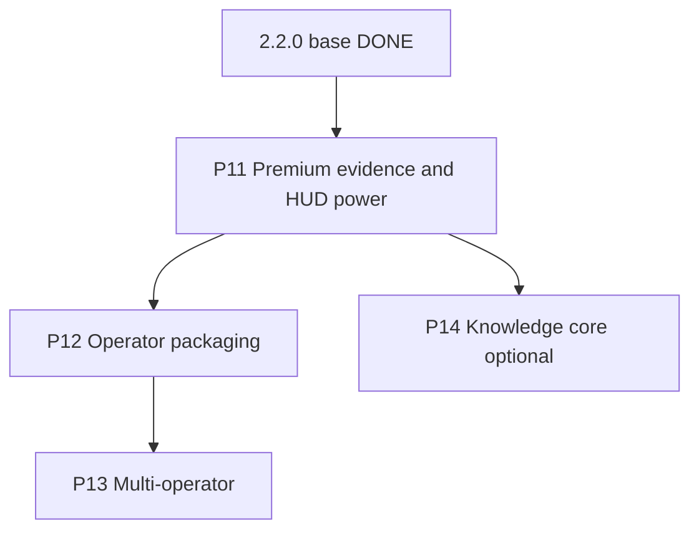

# STELLARIS-7 Evolution Plan (post-2.2.0)

Phases 1–10 and Final repo format are **DONE** in `2.2.0`. This document is the
plan for everything after. Contract: env-driven, seed fallback, no extra npm
deps, orbit never crashes, `npm test` + `npm run build` green.

Excluded from this line (do not schedule): IMAP/SMTP, GitHub issue write-back,
Hermes cron create, orchestration leftovers (server reducers, AgentSpec split,
handoffs-as-tools, ALS traces, WS `Command(resume)`).

## Verdict table

| Item | Verdict |
| --- | --- |
| Merge PR #2, CI, tag `2.2.0` | Do (ship hygiene) |
| Topbar version chrome | **P11.1** |
| TOKEN USAGE sparkline uses tokens not CTX | **P11.1** |
| Recapture 12-view screenshots + walkthrough | P11.1 (manual; gallery honest until recaptured) |
| Comms `_errors` / `meta.comms.error` badge | **P11.2** |
| Empty states | **P11.2** |
| Optimistic click pending lock | **P11.2** |
| Trace + checkpoint HUD | **P11.3** |
| Command palette + keyboard | **P11.4** |
| Vault filter, compose chips, calendar TODAY | P11.5 (if energy) |
| Packaged CLI `stellaris-hud serve` | P12 later |
| Multi-operator sessions | P13 later |
| Filesystem `data/vault/*.md` | P14 optional |
| Binary downloads, EXDATE, CalDAV REPORT, multi-login | Defer |

P11.1–11.4 **implemented** on this branch (TODAY shipped with 11.4). Vault
filter / compose chips remain P11.5. Stop after P11 unless an operator asks
for P12+.

## P11 — Premium evidence + HUD power

### 11.1 Ship hygiene

- Bind `#hud-version` to `HUD_VERSION` / `package.json` (`2.2.0`).
- TOKEN USAGE canvas plots `tokenSeries`; CONTEXT PRESSURE plots `ctxSeries`.
- README Features mention folders, week nav, readers, status cycles, attach.
- Screenshot gallery stays honest: existing 7 captures + live preview; do not
  invent PNG files.

### 11.2 Trust chrome

- Panel tag `SYNC WARN` when `meta.comms.error` or slice `_errors` is set.
- Empty folder / empty items / empty scheduler: `empty-hint`, not a blank table.
- Mutation clicks take a short pending lock so double-cycle cannot race WS.

### 11.3 Observability HUD

REST already exists (`POST /api/checkpoint`, rollback, `STATE.trace`, pause).

- Health: TRACE strip (last 12 spans: name, ms, tokens, ok/fail) + reader.
- Topbar: SNAP / REWIND next to PAUSE. Offline SNAP no-ops with a log line.
- Mission pipeline: chat workflows show a mini DAG from `plan[]`.

### 11.4 Command palette + keyboard

- `Ctrl/Cmd+K` palette: jump view, pause, SNAP, REWIND, ACK ALL, TODAY, compose.
- `1`–`9` / `0` jump first ten views; `[` `]` cycle the rail.
- `Esc` closes palette / clears readers. `R` replies when an email is selected.
- Ignore keys while focus is in an input. Respect `prefers-reduced-motion`.

### 11.5 Knowledge + comms UX (optional follow-up)

- Vault/Reports tag filter + title typeahead.
- Compose: selected-file chips; WARN log when a file exceeds the 200KB cap.
- Calendar TODAY (snap `weekStart` to this Sunday).

### Verify

- `npm test` / `npm run build` green.
- Views suite: token canvas mentions TOKEN; `#graph-token-foot` is `BUDGET …%`.
- Manual: palette, SNAP/REWIND, SYNC WARN, empty inbox tab.

## P12 — Operator packaging

README checkbox. `bin/stellaris-hud.js`: `serve` (orbit + `dist`), `demo`,
`probe`. Config `.stellaris.json` mirroring `.env.example`; env still wins.
Zero extra runtime deps. No plugin system.

## P13 — Multi-operator sessions

`meta.operators[]`. WS hello carries `operatorId`. Approval routes to the run
owner. Pause stays single-holder (`409`). Identity = HUD setting + optional
`USER_OPERATOR_NAME`. No in-app OAuth.

## P14 — Real knowledge core (optional)

Only if vault should be files again. `data/vault/*.md` + front matter; skills
write files then state; `STELLARIS_DATA_DIR` isolates tests. Until then,
state-backed `body` is the honest model — do not re-lie in docs.

## Implementation notes (P11)

- No new npm packages.
- Selection (email/event/vault/report/span) stays in `views.js` module state.
- Palette lives in `index.html` + `src/main.js`; commands call existing `api.*`.
- `handleChat` stamps `wf.plan` (`title`, `agent`, `dependsOn`) for the DAG.
- Pending lock is client-only (`Set` of ids, ~400ms).
